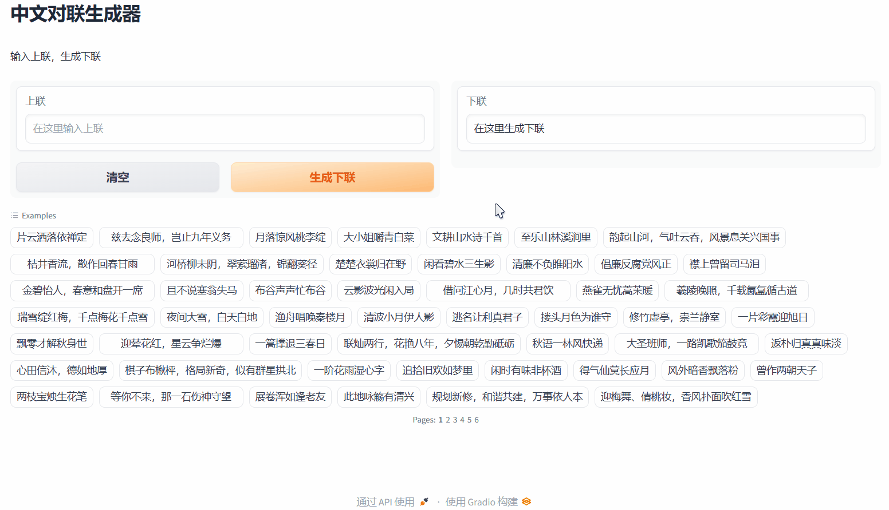
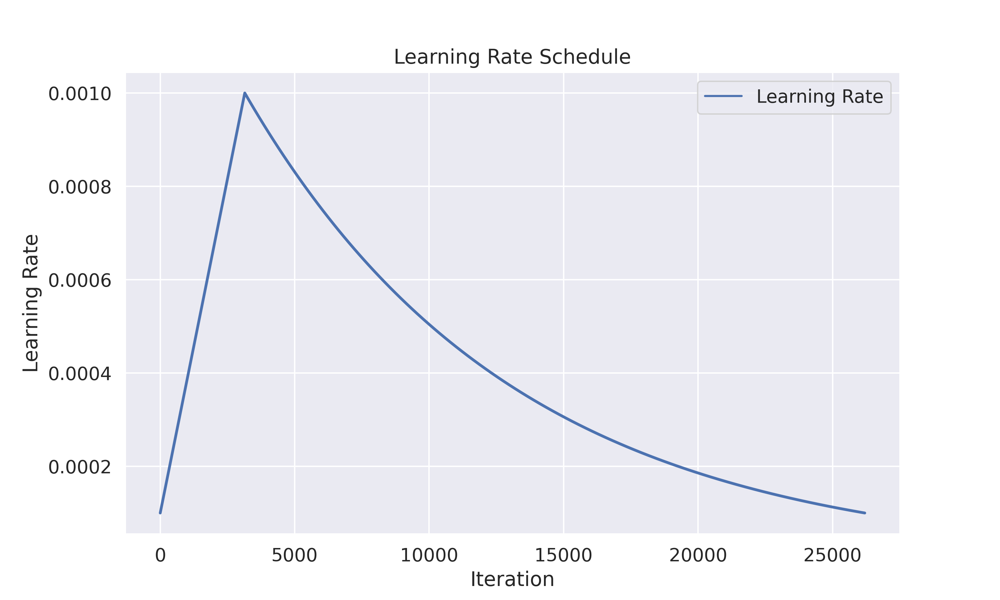
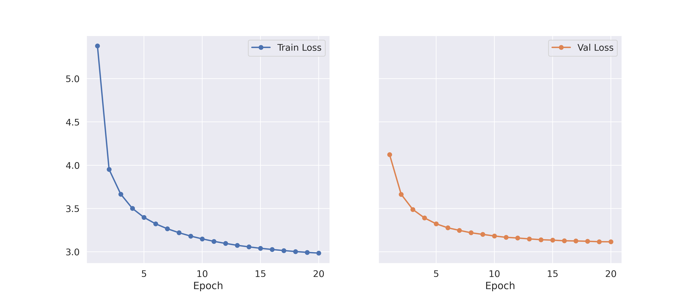

# 基于 Transformer 的中文对联生成器(Chinese Couplets Generator Based on Transformer)

## 目录(Table of Contents)

- [基于 Transformer 的中文对联生成器(Chinese Couplets Generator Based on Transformer)](#基于-transformer-的中文对联生成器chinese-couplets-generator-based-on-transformer)
  - [目录(Table of Contents)](#目录table-of-contents)
  - [简介(Introduction)](#简介introduction)
    - [项目结构(Structure)](#项目结构structure)
  - [部署(Deployment)](#部署deployment)
    - [克隆项目(Clone Project)](#克隆项目clone-project)
    - [安装依赖(Requirements)](#安装依赖requirements)
    - [训练模型(Train Model)](#训练模型train-model)
    - [启动 Web UI(Start Web UI)](#启动-web-uistart-web-ui)
  - [项目演示(Demo)](#项目演示demo)
    - [Web UI](#web-ui)
    - [学习率变化(Learning Rate Schedule)](#学习率变化learning-rate-schedule)
    - [训练历史(Training History)](#训练历史training-history)
  - [Star History Chart](#star-history-chart)

## 简介(Introduction)

本项目是一个**基于 Transformer 的中文对联生成器**，使用 PyTorch 构建模型，使用 Gradio 构建 Web UI。

数据集：[https://www.kaggle.com/datasets/marquis03/chinese-couplets-dataset](https://www.kaggle.com/datasets/marquis03/chinese-couplets-dataset)

### 项目结构(Structure)

```text
.
├── config
│   ├── __init__.py
│   └── config.py
├── data
│   ├── fixed_couplets_in.txt
│   └── fixed_couplets_out.txt
├── dataset
│   ├── __init__.py
│   └── dataset.py
├── img
│   ├── history.png
│   ├── lr_schedule.png
│   └── webui.gif
├── model
│   ├── __init__.py
│   └── model.py
├── trained
│   ├── vocab.pkl
│   └── CoupletsTransformer_best.pth
├── utils
│   ├── __init__.py
│   └── EarlyStopping.py
├── LICENSE
├── README.md
├── requirements.txt
├── train.py
└── webui.py
```

## 部署(Deployment)

### 克隆项目(Clone Project)

```bash
git clone https://github.com/Marquis03/Chinese-Couplets-Generator-based-on-Transformer.git
cd Chinese-Couplets-Generator-based-on-Transformer
```

### 安装依赖(Requirements)

```bash
pip install -r requirements.txt
```

### 训练模型(Train Model)

```bash
python train.py
```

Kaggle Notebook: [https://www.kaggle.com/code/marquis03/chinese-couplets-generator-based-on-transformer](https://www.kaggle.com/code/marquis03/chinese-couplets-generator-based-on-transformer)

### 启动 Web UI(Start Web UI)

```bash
python webui.py
```

## 项目演示(Demo)

### Web UI



### 学习率变化(Learning Rate Schedule)



### 训练历史(Training History)



## Star History Chart

[](https://star-history.com/#Marquis03/Chinese-Couplets-Generator-based-on-Transformer&Date)
